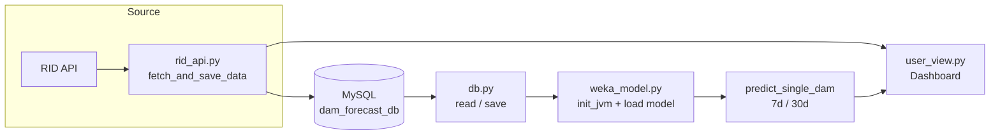

<div align="center">

# Thai Dam Forecast

**ระบบพยากรณ์ความเสี่ยงน้ำของอ่างเก็บน้ำ 35 แห่ง ในสังกัดกรมชลประทาน**

ใช้ Machine Learning (Weka) พยากรณ์สถานการณ์น้ำล่วงหน้า 7 และ 30 วัน
ผ่าน Web Dashboard ด้วย **Streamlit** - ดึงข้อมูลจริงจาก RID API อัตโนมัติ


</div>

---

## สารบัญ

- [ฟีเจอร์หลัก](#ฟีเจอร์หลัก)
- [สถาปัตยกรรม](#สถาปัตยกรรม)
- [โครงสร้างโปรเจค](#โครงสร้างโปรเจค)
- [การตั้งค่าระบบ](#การตั้งค่าระบบ)
- [การรัน](#การรัน)
- [ฐานข้อมูล](#ฐานข้อมูล)
- [โมเดลพยากรณ์](#โมเดลพยากรณ์)
- [แนวทางในอนาคต](#แนวทางในอนาคต)

---

## ฟีเจอร์หลัก

<div align="center">
<table>
<tr>
<td align="center"><strong>Forecast</strong></td>
<td align="center"><strong>DB-first</strong></td>
<td align="center"><strong>Auto-fetch</strong></td>
</tr>
<tr>
<td>พยากรณ์ความเสี่ยง<br>7 และ 30 วัน</td>
<td>อ่านจากฐานข้อมูลก่อน<br>ประหยัดการเรียก API</td>
<td>ดึงข้อมูล RID API<br>อัตโนมัติเมื่อโหลด</td>
</tr>
<tr>
<td align="center"><strong>Backfill</strong></td>
<td align="center"><strong>Graph</strong></td>
<td align="center"><strong>DB Backup</strong></td>
</tr>
<tr>
<td>ดึงข้อมูลย้อนหลัง<br>ในรอบเดียว</td>
<td>กราฟแนวโน้ม<br>ร้อยละความจุ</td>
<td>ไฟล์ backup ฐานข้อมูล<br>ในโฟลเดอร์ <code>data/</code></td>
</tr>
</table>
</div>

| ฟีเจอร์ | รายละเอียด |
|---------|------------|
| **พยากรณ์สถานการณ์น้ำ** | จำแนก Flood / Drought / Normal สำหรับ 7 และ 30 วันล่วงหน้า |
| **อ่านจากฐานข้อมูลก่อน (DB-first)** | ใช้ข้อมูลล่าสุดจาก DB ลดการโหลด RID API ซ้ำ |
| **ดึงข้อมูลอัตโนมัติ** | จัดการเงื่อนไขเวลา 12.00 น. - บันทึก/เติมข้อมูลรายวันอย่างถูกต้อง |
| **ข้อมูลย้อนหลัง (Backfill)** | ดึงข้อมูล 30 วันย้อนหลังในรอบเดียว |
| **กราฟแนวโน้ม** | แสดงร้อยละความจุย้อนหลังพร้อมเกณฑ์ความเสี่ยง |
| **Backup ฐานข้อมูล** | สร้างไฟล์ `.sql` ปัจจุบันลงในโฟลเดอร์ `data/` |

---

## สถาปัตยกรรม



**การไหลของข้อมูล:**
1. `app.py` เรียก `init_jvm_safe()` และ `load_resources()` เพื่อโหลดโมเดล Weka
2. `fetch_and_save_data()` ตรวจฐานข้อมูลก่อน -> อัปเดตจาก API ตามเงื่อนไขเวลา
3. ป้อนข้อมูลเขื่อนที่เลือกให้ `predict_single_dam()` เพื่อพยากรณ์ 7 และ 30 วัน
4. `user_view.py` เรนเดอร์ Dashboard พร้อมผลลัพธ์และกราฟ

---

## โครงสร้างโปรเจค

```
├── app.py                  # Entry point (Streamlit)
├── config.py               # อ่านคอนฟิกจาก .env (ไม่ hardcode)
├── requirements.txt        # dependencies
├── .env.example            # template ของ .env (ถูก gitignore)
│
├── core/
│   ├── db.py               # DB operations (save, query, backfill)
│   ├── rid_api.py          # RID API fetch + logic เวลา 12:00 น.
│   └── weka_model.py       # JVM init + model load + prediction
│
├── views/
│   └── user_view.py        # Main dashboard (single page)
│
├── models/
│   ├── trained/            # Weka models
│   │   ├── Logistic_7days.model   # 7 วัน
│   │   └── RF_30days.model        # 30 วัน
│   ├── datasets/           # ARFF datasets + header-only
│   └── results/            # Weka evaluation results
│
├── fetched/
│   ├── rid_dam_fetcher.py  # Data pipeline + ARFF export
│   └── historical_data.py  # Fetch real historical data
│
└── data/
    └── dam_forecast_db_backup.sql   # Backup ล่าสุดจากฐานข้อมูล
```

---

## การตั้งค่าระบบ

### 1. ติดตั้ง dependencies

```bash
pip install -r requirements.txt
```

### 2. ตั้งค่าไฟล์ .env

คัดลอก `.env.example` เป็น `.env` แล้วแก้ค่าฐานข้อมูลของคุณ

```bash
cp .env.example .env
```

ตัวแปรที่ใช้:

| ตัวแปร | ความหมาย |
|--------|----------|
| `DB_HOST` | ที่อยู่ MySQL (เช่น `localhost`) |
| `DB_USER` | ชื่อผู้ใช้ฐานข้อมูล (เช่น `root`) |
| `DB_PASSWORD` | รหัสผ่านฐานข้อมูล |
| `DB_NAME` | ชื่อฐานข้อมูล (เช่น `dam_forecast_db`) |
| `RID_API_URL` | URL API ของ RID |

> [!IMPORTANT]
> ไฟล์ `.env` อยู่ใน `.gitignore` ไม่ถูกอัปโหลดขึ้น GitHub
> แต่ `.env.example` เป็น template ที่ commit ได้

### 3. Restore ฐานข้อมูล

หากต้องการโหลดฐานข้อมูลจาก backup:

```bash
mysql -u root -p dam_forecast_db < data/dam_forecast_db_backup.sql
```

---

## การรัน

```bash
# หน้าหลัก
python -m streamlit run app.py

# หรือ
streamlit run app.py
```

---

## ฐานข้อมูล

- **DB**: MySQL (`dam_forecast_db`)
- **ตาราง**:

| ตาราง | รายละเอียด |
|-------|------------|
| `dam_daily` | ข้อมูลรายวัน (volume, percent_storage, inflow, outflow) |
| `dam_info` | ข้อมูลคุณลักษณะของเขื่อน (ความจุ, พื้นที่, เจ้าของ) |
| `users` | ข้อมูลผู้ใช้งานระบบ |

---

## โมเดลพยากรณ์

### Feature ที่ใช้ (5 ตัว)

| # | Feature | รายละเอียด |
|---|---------|------------|
| 1 | `volume` | ปริมาณน้ำ (ล้าน ลบ.ม.) |
| 2 | `percent_storage` | ร้อยละความจุ |
| 3 | `inflow` | น้ำไหลเข้า |
| 4 | `outflow` | น้ำไหลออก |
| 5 | `month` | เดือน (1-12) |

### Target classes

| Class | เงื่อนไข |
|-------|----------|
| `Normal` | 30% ≤ percent_storage ≤ 80% |
| `Flood` | percent_storage > 80% |
| `Drought` | percent_storage < 30% |

### Model

| ระยะเวลา | Algorithm | ไฟล์โมเดล |
|----------|-----------|-----------|
| 7 วัน | Logistic | `Logistic_7days.model` |
| 30 วัน | Random Forest | `RF_30days.model` |

---

## แนวทางในอนาคต

### Infrastructure
- [ ] Dockerize (MySQL + app)
- [ ] CI/CD (GitHub Actions)
- [x] Environment variables -> `.env`
- [x] `.gitignore` สำหรับ secrets, `.model`, `.arff`, `.xlsx`

### Model & Training
- [ ] Auto-retrain เมื่อมีข้อมูลใหม่
- [ ] เพิ่ม features (rainfall, reservoir capacity)
- [ ] เปรียบเทียบ XGBoost, LightGBM, LSTM
- [ ] แสดง confidence score

### UI & UX
- [ ] Multi-language (EN/TH)
- [ ] Map view แสดงสีความเสี่ยง
- [ ] Export PDF/CSV
- [ ] Line notify / email alert
- [ ] Mobile responsive

### Data & API
- [ ] API caching (Redis)
- [ ] เก็บข้อมูลเกิน 31 วัน
- [ ] Fallback API สำรอง
- [ ] Rate limiting

### Monitoring & Testing
- [ ] Structured logging
- [ ] pytest สำหรับ core/*
- [ ] Integration test (DB + API + Model)
- [ ] E2E Streamlit test (Playwright)

---

<div align="center">


<sub>ระบบพยากรณ์ความเสี่ยงน้ำ - จัดทำเพื่อการศึกษา</sub>

</div>