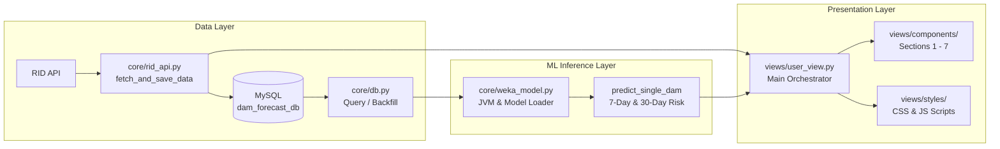

<div align="center">

# Thai Dam Forecast

**ระบบพยากรณ์ความเสี่ยงน้ำของอ่างเก็บน้ำ 35 แห่ง ในสังกัดกรมชลประทาน**

ใช้ Machine Learning (Weka) พยากรณ์สถานการณ์น้ำล่วงหน้า 7 และ 30 วัน
ผ่าน Web Dashboard ด้วย **Streamlit** - ดึงข้อมูลจริงจาก RID API อัตโนมัติ


</div>

---

## สารบัญ

- [ฟีเจอร์หลัก](#ฟีเจอร์หลัก)
- [โครงสร้างหน้า Dashboard (7 Sections)](#โครงสร้างหน้า-dashboard-7-sections)
- [สถาปัตยกรรม](#สถาปัตยกรรม)
- [โครงสร้างโปรเจค](#โครงสร้างโปรเจค)
- [การตั้งค่าระบบ](#การตั้งค่าระบบ)
- [การรันระบบ](#การรันระบบ)
- [ฐานข้อมูล](#ฐานข้อมูล)
- [โมเดลพยากรณ์](#โมเดลพยากรณ์)

---

## ฟีเจอร์หลัก

<div align="center">
<table>
<tr>
<td align="center"><strong>Forecast</strong></td>
<td align="center"><strong>DB-first Caching</strong></td>
<td align="center"><strong>Auto-fetch & Backfill</strong></td>
</tr>
<tr>
<td>พยากรณ์ความเสี่ยง 7 และ 30 วัน<br>ด้วย Machine Learning (Weka)</td>
<td>โหลดข้อมูลจากฐานข้อมูลก่อน<br>ลดการเรียก RID API ซ้ำซ้อน</td>
<td>ดึงข้อมูลรายวันตามรอบ 12:00 น.<br>พร้อมระบบดึงย้อนหลัง 30 วัน</td>
</tr>
<tr>
<td align="center"><strong>Modular Components</strong></td>
<td align="center"><strong>Smart Navigation</strong></td>
<td align="center"><strong>DB Backup</strong></td>
</tr>
<tr>
<td>สถาปัตยกรรมแยกโฟลเดอร์<br>และคอมโพเนนต์ชัดเจน</td>
<td>Sidebar นำทาง Smooth Scroll<br>พร้อมลูกเล่น Flash Highlight</td>
<td>สำรองข้อมูลฐานข้อมูลอัตโนมัติ<br>ในโฟลเดอร์ <code>data_backup/</code></td>
</tr>
</table>
</div>

| ฟีเจอร์ | รายละเอียด |
|---------|------------|
| **พยากรณ์สถานการณ์น้ำ** | จำแนกสถานะ Normal / Flood / Drought สำหรับ 7 วัน (Logistic) และ 30 วัน (Random Forest) |
| **อ่านจากฐานข้อมูลก่อน (DB-first)** | ตรวจสอบข้อมูลล่าสุดในฐานข้อมูลก่อนเสมอ หากมีข้อมูลแล้วจะไม่เรียก RID API ซ้ำ |
| **ดึงข้อมูลอัตโนมัติ** | ตรวจสอบรอบเวลา 12:00 น. เพื่อบันทึกและอัปเดตข้อมูลน้ำประจำวันจาก RID API |
| **ข้อมูลย้อนหลัง (Backfill)** | รองรับการดึงข้อมูลย้อนหลัง 30 วันเข้าสู่ฐานข้อมูลในรอบเดียว |
| **กราฟแนวโน้มและวิเคราะห์** | กราฟเส้นแสดงร้อยละความจุย้อนหลัง พร้อมเส้นเกณฑ์ความเสี่ยงวิกฤตน้ำท่วมและน้ำแล้ง |
| **Sidebar นำทางแบบไฮไลท์** | แถบเมนูด้านข้างพร้อม Smooth Scrolling และแอนิเมชันกระพริบเน้น Section (Single Pulse Highlight) |
| **โครงสร้างคอมโพเนนต์แบบแยกส่วน** | แยกโค้ด UI เป็นโมดูลย่อย 7 Section ใน `views/components/` บำรุงรักษาง่าย |

---

## โครงสร้างหน้า Dashboard (7 Sections)

Dashboard แบ่งส่วนการแสดงผลออกเป็น 7 ส่วนหลักเรียงลำดับอย่างเป็นระบบ:

1. **Section 1: ค้นหา / เลือกอ่างเก็บน้ำ (`#section-select`)**
   - กล่องเลือกอ่างเก็บน้ำ 35 แห่งทั่วประเทศ พร้อมแท็กภาคและข้อมูลความจุ
2. **Section 2: ภาพรวมสถานการณ์น้ำปัจจุบัน (`#section-overview`)**
   - การ์ดสรุปปริมาณน้ำปัจจุบัน, ร้อยละความจุ, น้ำไหลเข้า (Inflow), และน้ำระบายออก (Outflow)
3. **Section 3: ผลการพยากรณ์ระดับสถานการณ์น้ำ (`#section-forecast`)**
   - การ์ดผลการทำนายล่วงหน้า 7 วัน และ 30 วัน พร้อมระดับความน่าจะเป็น (Confidence Level) และธีมสีเตือนภัย
4. **Section 4: แนวโน้มร้อยละความจุของอ่างเก็บน้ำย้อนหลัง (`#section-trend`)**
   - กราฟแนวโน้มร้อยละความจุย้อนหลัง พร้อมเกณฑ์ระดับน้ำเฝ้าระวัง (วิกฤตน้ำแล้ง < 30%, ปกติ 30-80%, วิกฤตน้ำท่วม > 80%)
5. **Section 5: รายละเอียดข้อมูลอ่างเก็บน้ำ (`#section-details`)**
   - ข้อมูลจำเพาะทางวิศวกรรมของเขื่อน เช่น ความจุเก็บกักสูงสุด-ต่ำสุด, ระดับเก็บกักปกติ, ที่ตั้ง, และหน่วยงานรับผิดชอบ
6. **Section 6: ข้อมูลย้อนหลัง (`#section-history`)**
   - ตารางบันทึกข้อมูลย้อนหลังรายวัน (ปริมาณน้ำ, ความจุ, น้ำไหลเข้า, น้ำไหลออก)
7. **Section 7: สรุปสถานการณ์น้ำ (`#section-summary`)**
   - กล่องสรุปสถานะความเสี่ยงปัจจุบันและภาพรวมคำแนะนำในการบริหารจัดการน้ำ
8. **แหล่งข้อมูลและเครดิต (`#section-about`)**
   - กล่องข้อมูลอ้างอิง API กรมชลประทาน (RID) และคำสงวนสิทธิ์การใช้งาน

---

## สถาปัตยกรรม



**การไหลของข้อมูล:**
1. `app.py` เริ่มต้นการทำงานด้วยการเรียก `init_jvm_safe()` และโหลดโมเดล Machine Learning ล่วงหน้า
2. `fetch_and_save_data()` ตรวจสอบข้อมูลใน MySQL ก่อน หากยังไม่มีข้อมูลล่าสุดของวันและเลยเวลา 12:00 น. จะดึงข้อมูลจาก RID API มาบันทึกลงฐานข้อมูล
3. `weka_model.py` แปลงฟีเจอร์เป็นสัดส่วนร้อยละ (`percent_storage`, `inflow_pct`, `outflow_pct`, `month`) แล้วพยากรณ์ผลลัพธ์ 7 วันและ 30 วัน
4. `user_view.py` ส่งต่อข้อมูลและผลการพยากรณ์ไปยังคอมโพเนนต์ต่างๆ ใน `views/components/` เพื่อเรนเดอร์หน้าจอ Streamlit

---

## โครงสร้างโปรเจค

```
├── app.py                      # Entry point (Streamlit application)
├── config.py                   # ตัวแปรสภาพแวดล้อม (.env configuration)
├── requirements.txt            # รายการ Python dependencies
├── .env.example                # ไฟล์ตัวอย่างสำหรับการตั้งค่า Environment
│
├── core/                       # Backend Logic & Model Inference
│   ├── db.py                   # จัดการฐานข้อมูล (Query, Save, Backfill)
│   ├── rid_api.py              # ดึงข้อมูล RID API ตามเงื่อนไขเวลา 12:00 น.
│   └── weka_model.py           # JVM Initialization, Model Loading & Inference
│
├── pipelines/                  # Data Preparation & Pipeline
│   ├── rid_dam_fetcher.py      # ดึงข้อมูลเขื่อนและ Export สู่รูปแบบ ARFF
│   └── historical_data.py      # เครื่องมือดึงข้อมูลประวัติย้อนหลัง
│
├── fetched/                    # Backward-compatibility shims
│   ├── rid_dam_fetcher.py      # Shim ส่งต่อการเรียกไปยัง pipelines/
│   └── historical_data.py      # Shim ส่งต่อการเรียกไปยัง pipelines/
│
├── views/                      # Presentation Layer (Modular Architecture)
│   ├── user_view.py            # Main dashboard orchestrator
│   ├── constants.py            # นิยามค่าคงที่ สี ความหมายสถานะ และเกณฑ์ความเสี่ยง
│   ├── icons.py                # SVG icons & helpers
│   ├── utils.py                # ฟังก์ชันแปลงวันที่ รูปแบบตัวเลข และตรรกะสถานะ
│   ├── styles/                 # รูปแบบการแสดงผลและสคริปต์ฝั่ง Client
│   │   ├── custom_css.py       # Custom CSS สไตล์โมเดิร์นและการจัด Padding
│   │   └── client_js.py        # Client JavaScript (Smooth scroll & Flash highlight)
│   └── components/             # โมดูล UI แยกตามหน้าที่และ Section
│       ├── sidebar.py          # แถบเมนูนำทางด้านข้างพร้อมระบบไฮไลท์
│       ├── header.py           # ส่วนหัว Dashboard และเวลาอัปเดตข้อมูล
│       ├── dam_selector.py     # Section 1: กล่องค้นหาและเลือกอ่างเก็บน้ำ
│       ├── current_overview.py # Section 2: ภาพรวมสถานการณ์น้ำปัจจุบัน (Metric cards)
│       ├── forecast_cards.py   # Section 3: การ์ดผลการพยากรณ์ 7 และ 30 วัน
│       ├── trend_and_details.py# Section 4: กราฟแนวโน้ม + Section 5: รายละเอียดเขื่อน
│       ├── history_and_summary.py # Section 6: ตารางย้อนหลัง + Section 7: สรุปสถานการณ์
│       └── footer.py           # ส่วนท้ายหน้าเว็บ
│
├── models/
│   ├── trained/                # โมเดล Weka (.model: Log_7days, RF_30days)
│   ├── datasets/               # ไฟล์ชุดข้อมูล ARFF และ Header ARFF
│   └── results/                # สรุปผลการประเมินประสิทธิภาพโมเดล
│
└── data_backup/
    └── dam_forecast_db_backup.sql # ไฟล์สำรองฐานข้อมูล MySQL
```

---

## การตั้งค่าระบบ

### 1. ติดตั้ง Dependencies

```bash
pip install -r requirements.txt
```

### 2. ตั้งค่าไฟล์ .env

คัดลอก `.env.example` เป็น `.env` แล้วกำหนดค่าการเชื่อมต่อฐานข้อมูล:

```bash
cp .env.example .env
```

ตัวแปรสภาพแวดล้อมที่จำเป็น:

| ตัวแปร | ความหมาย | ตัวอย่าง |
|--------|----------|----------|
| `DB_HOST` | ที่อยู่โฮสต์ MySQL | `localhost` |
| `DB_USER` | ชื่อผู้ใช้ MySQL | `root` |
| `DB_PASSWORD` | รหัสผ่าน MySQL | `your_password` |
| `DB_NAME` | ชื่อฐานข้อมูล | `dam_forecast_db` |
| `RID_API_URL` | URL สำหรับเรียก RID API | `http://app.rid.go.th:8080/...` |

> [!IMPORTANT]
> ไฟล์ `.env` มีข้อมูลความลับและถูกระบุใน `.gitignore` เรียบร้อยแล้ว ห้ามนำขึ้น Public Repository

### 3. Restore ฐานข้อมูล

หากต้องการนำเข้าฐานข้อมูลเริ่มต้นจากไฟล์ Backup:

```bash
mysql -u root -p dam_forecast_db < data_backup/dam_forecast_db_backup.sql
```

---

## การรันระบบ

```bash
# รันผ่าน Streamlit
streamlit run app.py

# หรือรันผ่านโมดูล Python
python -m streamlit run app.py
```

---

## ฐานข้อมูล

- **ระบบฐานข้อมูล**: MySQL (`dam_forecast_db`)
- **โครงสร้างตารางหลัก**:

| ตาราง | รายละเอียด | คอลัมน์สำคัญ |
|-------|------------|--------------|
| `dam_daily` | ข้อมูลสถานการณ์น้ำรายวัน | `dam_id`, `dam_date`, `volume`, `percent_storage`, `inflow`, `outflow` |
| `dam_info` | ข้อมูลทางกายภาพของอ่างเก็บน้ำ | `dam_id`, `dam_name`, `capacity`, `region`, `agency` |
| `users` | ข้อมูลผู้ใช้งานระบบ | `user_id`, `username`, `password_hash`, `role` |

---

## โมเดลพยากรณ์

### Features ที่ใช้ในการเทรนและพยากรณ์ (4 ตัวแปรแบบ Normalized)

เพื่อแก้ปัญหาความแตกต่างของขนาดความจุระหว่างเขื่อนขนาดใหญ่และเขื่อนขนาดกลาง โมเดลจึงใช้ตัวแปรในรูปสัดส่วนร้อยละ:

| # | Feature | ประเภท | รายละเอียด |
|---|---------|--------|------------|
| 1 | `percent_storage` | Numeric (%) | ร้อยละปริมาตรน้ำเทียบกับความจุเก็บกัก |
| 2 | `inflow_pct` | Numeric (%) | ร้อยละของปริมาณน้ำไหลเข้าเทียบกับความจุเก็บกัก |
| 3 | `outflow_pct` | Numeric (%) | ร้อยละของปริมาณน้ำไหลออกเทียบกับความจุเก็บกัก |
| 4 | `month` | Numeric (1-12) | ลำดับเดือน เพื่อจับรูปแบบฤดูกาล (Seasonal pattern) |

### ระดับความเสี่ยง (Target Classes)

| Class | คำอธิบาย | เกณฑ์การจำแนก |
|-------|----------|---------------|
| `Normal` | ระดับน้ำปกติ | 30% ≤ `percent_storage` ≤ 80% |
| `Flood` | เสี่ยงน้ำล้น/น้ำท่วม | `percent_storage` > 80% |
| `Drought` | เสี่ยงวิกฤตน้ำแล้ง | `percent_storage` < 30% |

### อัลกอริทึมโมเดล (Machine Learning Algorithms)

| ระยะเวลาทำนาย | อัลกอริทึม | ไฟล์โมเดล | จุดเด่น |
|---------------|------------|-----------|---------|
| **7 วันล่วงหน้า** | **Logistic Regression** | `Log_7days.model` / `Logistic_7days.model` | ให้ผลลัพธ์แม่นยำสูงในระยะสั้น ประมวลผลรวดเร็ว |
| **30 วันล่วงหน้า** | **Random Forest** | `RF_30days.model` / `RandomForest_30days.model` | จัดการความสัมพันธ์ไม่เป็นเชิงเส้นและรูปแบบฤดูกาลได้ดีเยี่ยม |

---

<div align="center">

<sub>Thai Dam Forecast &bull; ระบบพยากรณ์สถานการณ์น้ำเพื่อการศึกษาและการบริหารจัดการ</sub>

</div>
